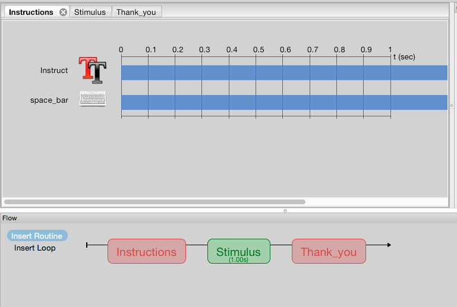
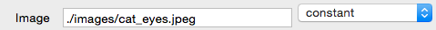
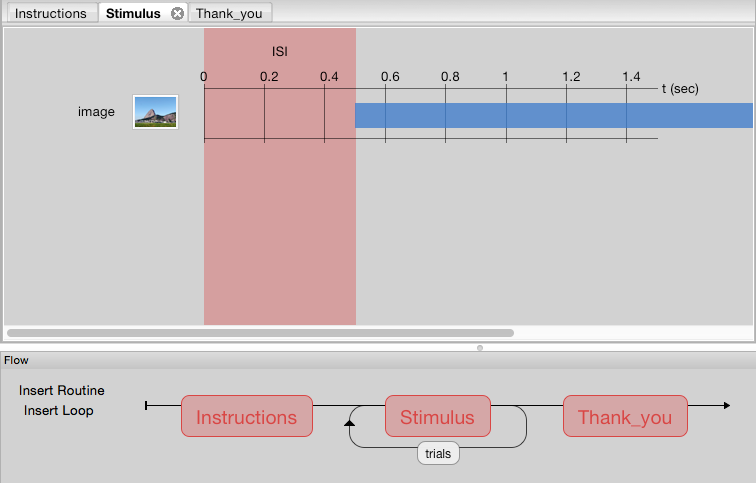

# Looping through conditions

Now that we have our basic structure:

We can go on to add the stimulus to the experiment.

Click on "Stimulus" in the Flow, and click on the  in the Components panel. 
You can see several options for this image. You should see that the duration of image is 1sec.

In this lesson, you will learn how import images as your stimuli. Lets start with an example of one image.

In the folder on your desktop, you will see a subdirectory called 'images'. The 'images' directory holds the images for this experiment.

In the Image dialoge box, we need to type the path to the image that we want to display. Lets use the cat_eyes.jpeg file. Enter the path to the file like so:  

We can test to see if this works by running the experiment. Click OK and then the Run icon.

This works fine, but what if you want to see the image more than once?

Click the 'Insert Loop' button in the Flow panel.
CLick the first dot just after the Stimulus and the second dot just before it. Again, a dialog box apears with several options. We can use the defaults to test the loop.

It appears there was only one presentation of the cat, but actually, the cat was repeated 5 times at 1 second each. We need to include an interstimulus interval to separate the images.

In the Components panel, click Custom then Static Properties. The default is 500ms, which is fine. Click OK and you will see a pink shaded area for 500ms.
We want it to start before the stimulus, so change the start time of the image to 1.0. 

Run the experiment again.

So we have a stimulus, but what about a response? Let's add a button press for reaction time and accuracy.
Click on the  in the Components panel. There are several options again, change the 'Allowed keys' box to say 'space', this will indicate a response by spacebar press.

Click again on the  in the workspace, and change the duration of the stimulus presentation to 0. This indicates an infinite presentation. The image will now be changed following the button press.

The icon now appears in the workspace.

