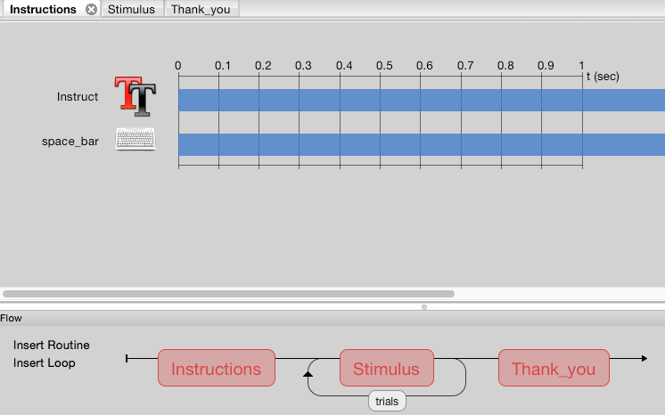
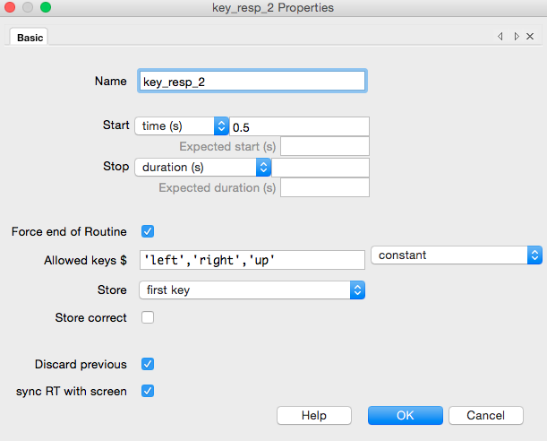

# Looping through conditions

Now that we have our basic structure:

We can go on to add the stimulus to the experiment.

Click on 'Stimulus' in the Flow, and click on the  in the Components panel. 
You can see several options for this image. You should see that the duration of image is 1sec.

In this lesson, you will learn how import images as your stimuli. Lets start with an example of one image.

In the folder on your desktop, you will see a subdirectory called 'images'. The 'images' directory holds the images for this experiment.

In the Image dialoge box, we need to type the path to the image that we want to display. Lets use the cat_eyes.jpeg file. Enter the path to the file like so:  

We can test to see if this works by running the experiment. Click OK and then the Run icon 

In the directory the experiment is saved in, you will now see a 'Data' directory. This is where the output saves. Click on the .csv to see what is inside.

This works fine, but what if you want to see the image more than once?

Click the 'Insert Loop' button in the Flow panel.
Click the first dot just after the Stimulus and the second dot just before it. Again, a dialog box apears with several options. We can use the defaults to test the loop.

It appears there was only one presentation of the cat, but actually, the cat was repeated 5 times at 1 second each. We need to include an interstimulus interval to separate the images.

In the Components panel, click Custom then Static Properties. The default is 500ms, which is fine. Click OK and you will see a pink shaded area for 500ms.
We want it to start before the stimulus, so change the start time of the image to 0.5 and the duration to 1.0. 

Run the experiment again, click 

So we have a stimulus, but what about a response? Let's add a button press for reaction time and accuracy.
Click on the  in the Components panel. There are several options again, type 'space' into the 'Allowed keys' box to indicate a response by spacebar press.

Click again on the in the workspace, and change the duration of the instructions presentation to 0. Now the picture will be presented until the spacebar is pressed. 

The icon now appears in the workspace.

We now have instructions and a stimulus that flashes for 1 second 5 times. Often in behavioural neuroscience and psychology we are interested in response time and accuracy, and the difference between different types of stimuli.

In Psychopy we can add different stimuli to the loop. In this example we will use images of gorillas, kittens and hedgehogs. The instructions will be:  
*You will see pictures*

*Press left for gorillas*  
*Press right for kittens*  
*Press up for hedgehogs*

*Press spacebar to continue*

Click on the  icon in Instructions and type the above into the 'Text' box.

Now we need the images. To do this, you can set up an excel or csv with each column representing a condition.
  
The first column indicates the correct response, the second is the directory path to the image file, and the third is the category or type of the image.

Psychopy can read this file to select the images, rather than us having to include each stimulus individually. To tell Psychopy where to look for this spreadsheet, make sure it is located in the images folder along with all of the images used in this experiment.

Then click on the loop icon in the Flow and in the dialog box that appears type the directory path from where your experiment is saved to where the spreadsheet is saved. In this case, from the experiment the path to the spreadsheet is 'images/datafile.xlsx'. You can also click the 'Browse...' button to search and select the file. Psychopy recognises the file if below there is a summary of what is included. Here, we have 10 conditions (images) with 2 parameters (correct answer and image type).

Now, to communicate this loop to the stimus that will be presented, click on Stimulus in the Flow, and the . In the Image box, we now need to point to the excel file that was loaded in to the loop. Type '$images' into the dialog box. The $ tells Psychopy to look in the spreadsheet for the column 'images' **(I forget how to explain this)**. Change the associated dropdown box to 'set every repeat'. Click OK.

We now need a response key press for the images. Click the , and type ''left','right','up'' into 'Allowed keys'. In the 'Store' drop-down, select 'first key', and 'Start' to 0.5.

Finally, click the  and delete the time limit in the 'Stop' dialog box.

Your Stimulus should look like this:

Let's do it! Click 

# Data time!

