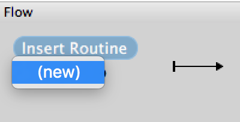
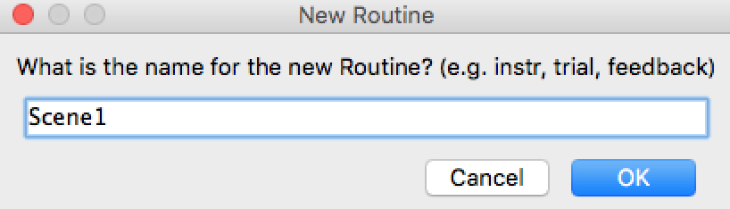
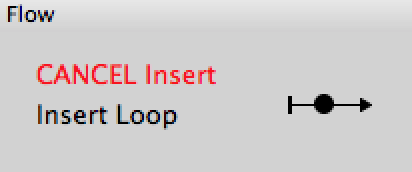
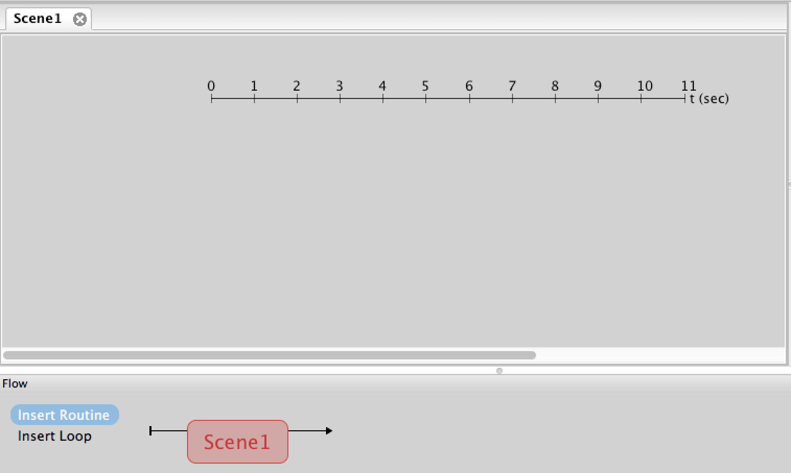
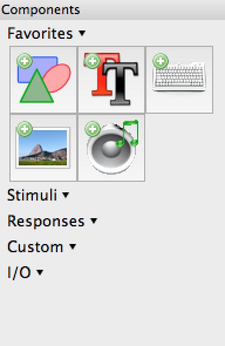
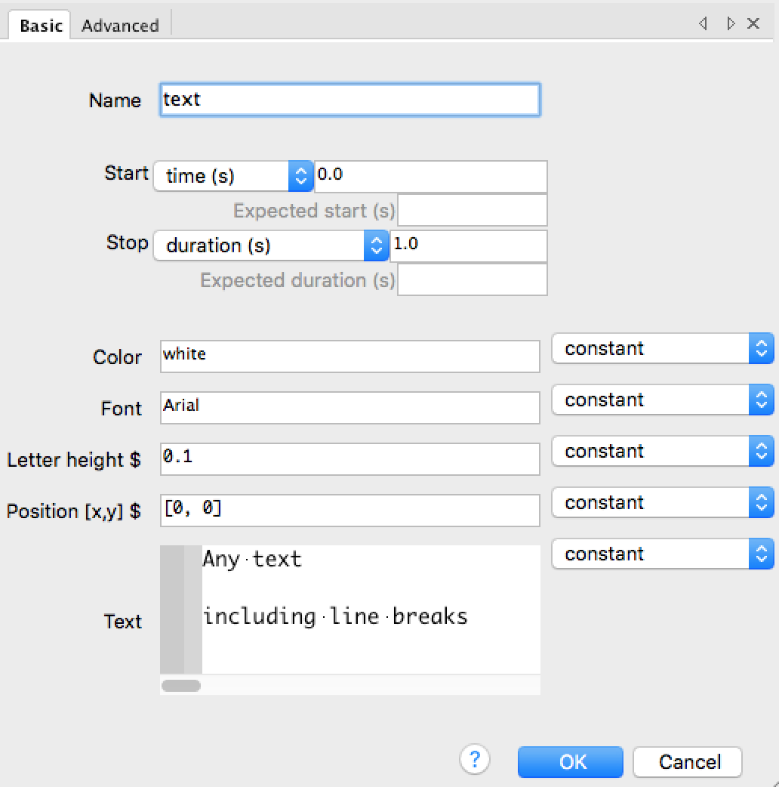
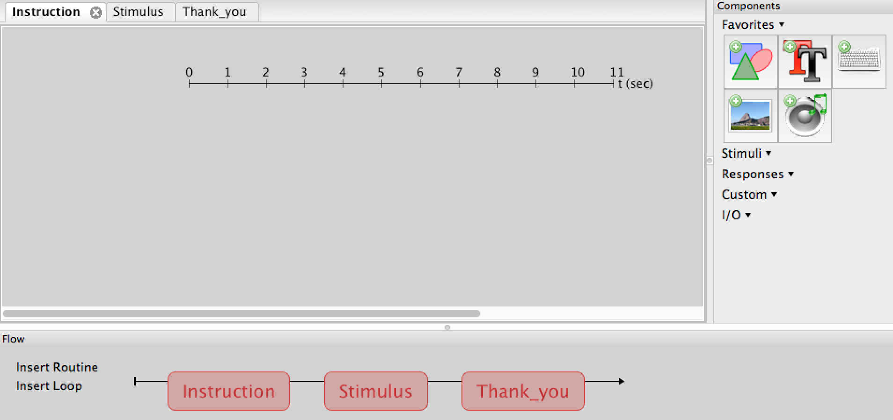
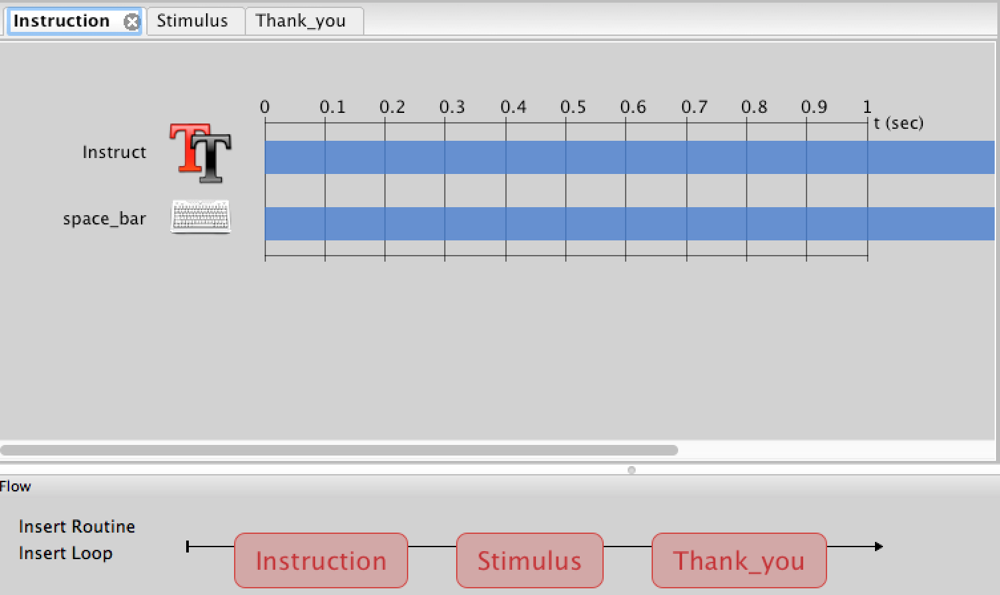

**Introduction to experiments in Psychopy**
-

An experiment within the fields of experimental psychoogy and cognitive neurosciense is a task designed to assess how we percieve and process specific types of information. Experimenters often **deliver information** and **collect response** to measure and analyse.

**Building an experiment with Psychopy**
-
In Psychopy, an experiment is like a movie which contains individual scenes and sets. Just like a movie a psychopy experiment is made up of scenes called **Routines** which are contained within a timeline called **Flow**. 

We add a new scene by clicking on **Insert Routine**, naming our new routine then selecting where on the timeline we'd like it to be by clicking on the black dot.

  

Each scene comes with its own working window that has its own timeline.

 

Within each scene, we add items such as text, shapes, images, video and audio, which we can choose from the list of **Components** on the right side. The properties window that appears when we click on a component allows us to input things like duration, location, size and colour of the item we are adding to our scene. One of the most important features is adjusting the starting time and duration of the item.  We can either input how long we want the item to be displayed, or leave the duration blank (which means infinite) and add keyboard response so that it remains on the screen until the participants respond by pressing a designated jey on the keyboard.

 

Now let us start building an experiment what contains an instruction, a stimulus and a thank you section.

Insert Routine > new > 'Instruction'

Insert Routine > new > 'Stimulus'

Insert Routine > new > 'Thank you'

Once we have our scenes outlined, we can click on the first scene which is out **Instruction** and select the text icon from the **Components** on the right.  Here we can add our instruction for what we would like participants to do.  For example:

"Press the spacebar to start task."

And we click on the keyboard icon on the right to add a keyboard response.  Remember to make the duration of the instructio text infinite so that the text remains on the screen until the spacebar is pressed.  

Next... we will add our stimulus.

