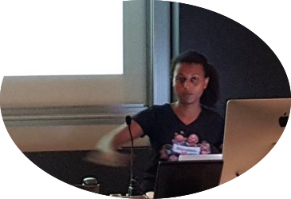
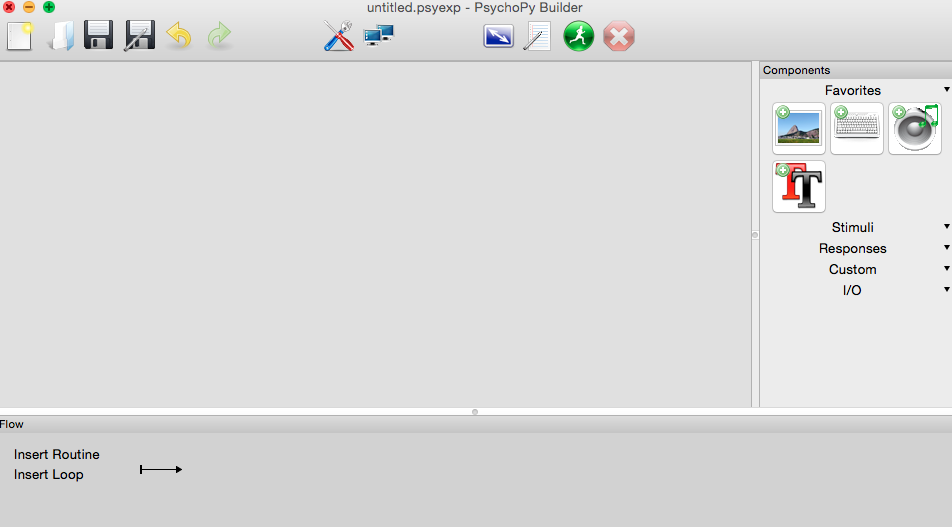
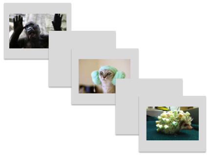

  It was electives day at ResBaz, and maybe it was the crazy turn in weather or the extremely good food, but Brook ([@brookshiferaw](https://twitter.com/brookshiferaw)) and Talitha ([@TalithaCFord](https://twitter.com/TalithaCFord)) got all psycho with py! Well, not really, but they did share some pretty cool insights into the amazing world of [Psychopy](http://www.psychopy.org/)! 

 Psychopy, as the name suggests, is a Python based software used for creating and running psychophysical, cognitive experiments. Psychopy is much more than just that though, and can be used to create a huge variety of stimuli and record a response. Great huh?! "But, I don't know Python!" we hear you say? Well, that's ok, because its a stand alone graphical user interface (GUI) with super intuitive click and drop options. Too good to be true? Nope, it's as true as the Research Bazaar is awesome.

So, Brook and Talitha go to work, sharing the Psychopy love. They went from this:  

To this:  
  

creating an experiment that tests response reaction time and accuracy to super serious image categories such as these....   

 
Then, quick as a flash, Talitha was running through a quick analysis of the resulting .csv data file using the [iPython Notebook](http://ipython.org/notebook.html)! Amazing right? Want to know more? [Here is the  lesson](http://tcford.github.io/psychopy_lesson/)

Thanks to all that attended the workshop, hopefully there will be more like it in the not to distant future.

